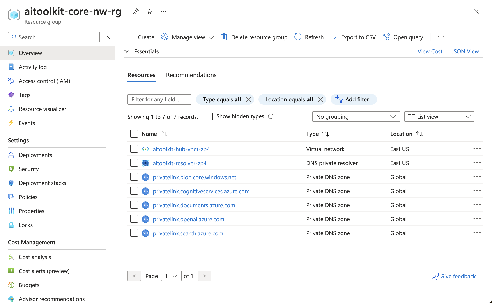
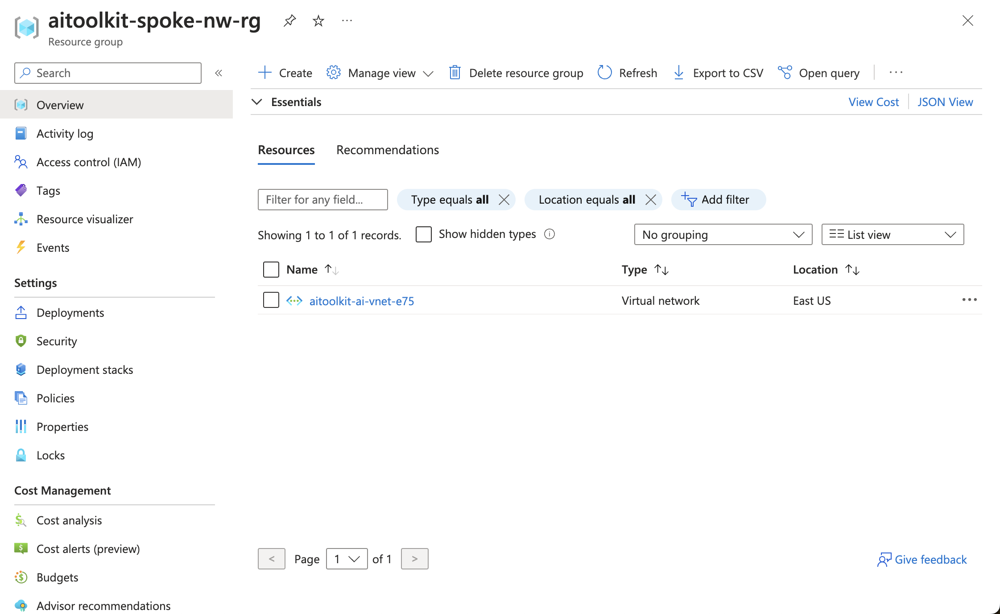
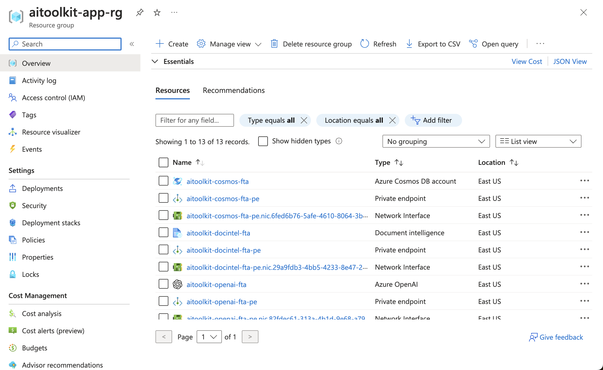

# Cognitive Services Landing Zone in-a-box


## When should you use this box?

- You're looking for a **minimal**, **secure networking** environment to deploy Cognitive Services;
- You need to **disable public internet access** to your services;
- You want to **centralize DNS resolution** services deployed on Azure;


## What comes in this box?

When you deploy Cognitive Services Landing Zone in-a-box, you get:

- Three Resource Groups:
    - **Core Networking Resource Group**: 
    Contains Hub Virtual Network, Private DNS Zones and Private DNS Resolver
    
    - **Spoke Networking Resource Group**: 
    Contains the Spoke VNet resource
    
    - **AI Application Resource Group**: 
    Contains Cognitive and other PaaS services that can support an application workload, along with their associated Provate Endpoints.
    

This setup contains everything you need to deploy an application to Azure App Services securely.

## What's not included in this box?

- An ExpressRoute/VPN connection to your on-premises environment. [Learn how to connect your on-prem to the Hub VNet with a VPN Gateway](https://learn.microsoft.com/en-us/azure/vpn-gateway/tutorial-create-gateway-portal)
- An Azure Firewall. [Learn more about setting up a Firewall](https://learn.microsoft.com/en-us/azure/firewall/tutorial-firewall-deploy-portal-policy)

## Solution Architecture

The solution architecture is described in the diagram below.


## Pre-requisites

- Install Azure CLI
- Log into your Azure subscription

```
az login
```

## Deploy to Azure

1. Configure deployment parameters on `main.bicepparam`
2. Deploy resources
```
az deployment sub create -f main.bicep --parameters main.bicepparam
```
If this step causes you any errors, try updating your Azure CLI.


## Supported Scenarios and Next Steps

- [Deploy a web-based RAG application targetting your new services](https://github.com/microsoft/sample-app-aoai-chatGPT)
- [Use the Semantic Kernel Bot in-a-box pattern to create an advanced Bot Framework-based solution](../semantic-kernel-bot-in-a-box/)
